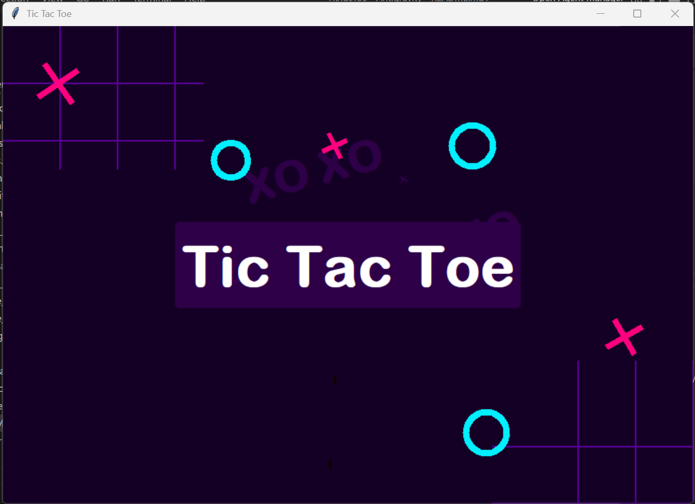
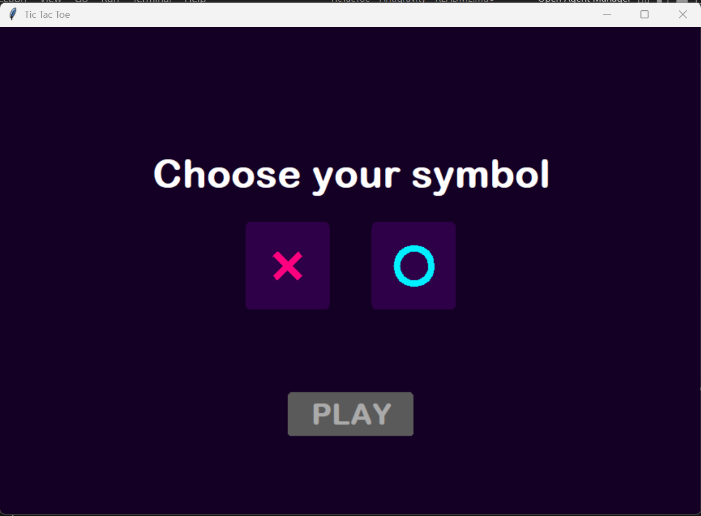
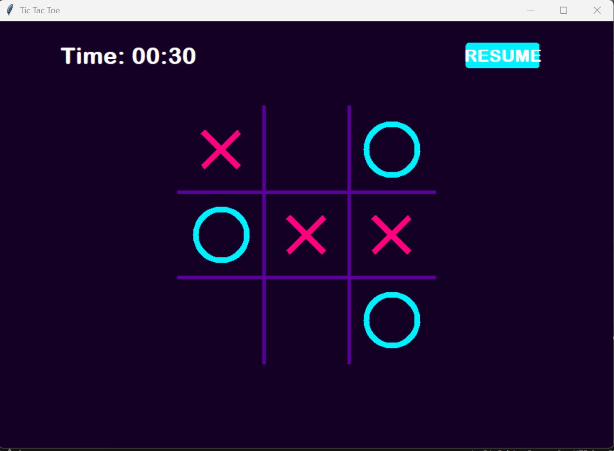
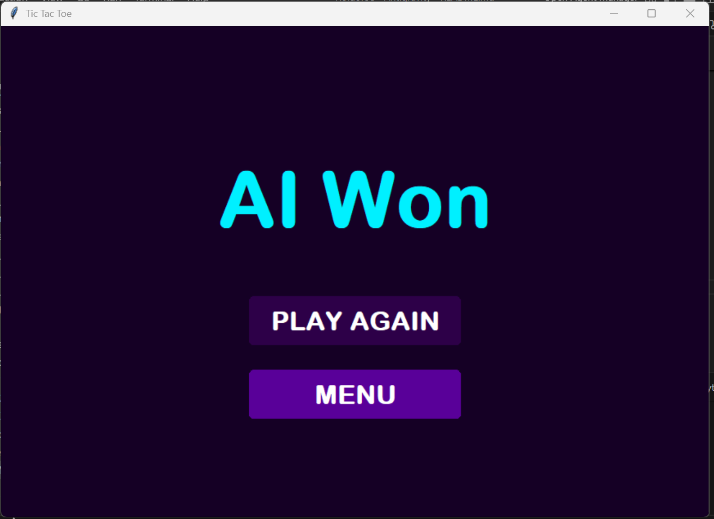

 # Description  

 This project implements the classic TicTacToe game integrated with an Artificial Intelligence agent trained using the Q-learning algorithm (Reinforcement Learning).

The AI agent learns how to play the game by interacting with the environment, receiving rewards, and updating its Q-table over multiple training episodes. After sufficient training, the agent is capable of playing optimally against a human player.

# Project Objectives 

- Implement the logic of the TicTacToe game
- Design a Reinforcement Learning agent using Q-learning
- Train the agent to learn optimal strategies
- Connect the trained agent to a Graphical User Interface
- Allow a human player to play against the AI

# How the System Works ? 

 # 1 Game Environment :
   It represents the environment in which the agent interacts : 
    - Initializing the 3x3 board
    - Managing player moves
    - Validating available actions
    - Resetting the game state

 # 2 Game Rules  :

  - Checks winning conditions
  - Detects draw situations
  - Determines when the game is finished

 # 3 Reinforcement Learning agent
   The agent uses the Q-learning algorithm 

   - Uses a Q-table to store state action values
   - Chooses actions using an epsilon
   - Updates Q-values using the formula : 

    Q(s, a) = Q(s, a) + alpha * [ reward + gamma * max Q(s', a') - Q(s, a) ]

# Training : 
  1. The game is reset
  2. The agent selects actions
  3. The environment returns rewards
  4. The Q-table is updated
  5. The process repeats for many episodes

# Interface : 
     

    

    

    

# structure : 

agent/
│
├── implementation/
│   ├── agent.py
│   ├── learning.py
│   ├── policy.py
│   ├── q_table.py
│   ├── stats.py
│   
│
├── training/
│   ├── train.py
│
environment/
│   ├── game_env.py
│   ├── game_rules.py
│   ├── test_game.py
│
gui/
│   ├── interface.py

#  How to Run the Project ?

python gui/interface.py